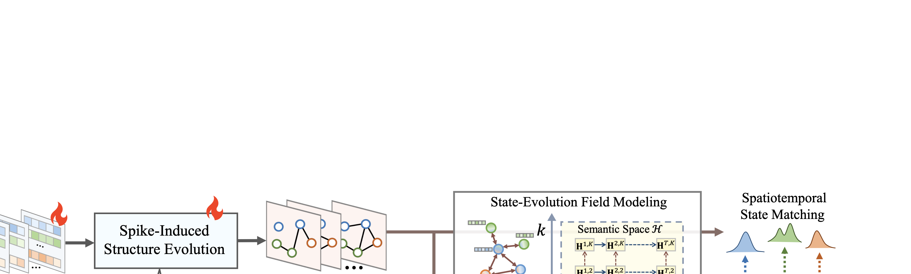

<h1 align="center">Evolution-Consistent Dynamic Graph Condensation</h1>

<p align="center">
  <a href="https://arxiv.org/abs/2506.13099"></a>
</p>

<p align="center">
  <a href="README.md">English</a>
</p>

DyGC（动态图蒸馏）是一个用于压缩大规模动态图的框架，同时保持图的时序和结构特性。它学习一个小型合成图，使得在该图上训练的 GNN 模型能够达到与在完整图上训练相当的性能。

## 框架



## 项目结构

```
DyGC/
├── scripts/                         # 运行脚本
│   ├── run_small.sh                 # 小规模图脚本 (dblp, reddit)
│   └── run_large.sh                 # 大规模图脚本 (arxiv, tmall)
├── src/                             # 源代码
│   ├── condense.py                  # 小规模图蒸馏
│   ├── condense_large.py            # 大规模图蒸馏
│   ├── subgraph_extracter.py        # 大图子图提取
│   ├── test.py                      # 小图测试脚本
│   ├── test_large.py                # 大图测试脚本
│   ├── models/                      # 模型实现
│   │   ├── DGNN.py                  # 动态 GNN 模型
│   │   ├── basicgnn.py              # 基础 GNN 组件
│   │   ├── structure_generation.py  # 结构学习模块
│   │   └── convs/                   # 图卷积层
│   └── utils/                       # 工具函数
│       ├── graph_utils.py           # 图数据工具
│       ├── kernels.py               # 核函数
│       └── losses.py                # 损失函数 (MMD)
├── data/                            # 数据目录
│   ├── raw/                         # 原始数据文件 (.npz)
│   ├── processed/                   # 处理后数据文件 (.pt)
│   ├── splited/                     # 大图采样子图
│   └── scripts/                     # 数据预处理脚本
│       ├── get_data.py              # 处理小规模数据集
│       └── get_arxiv.py             # 下载处理 arxiv
├── syn/                             # 蒸馏图输出
├── teacher/                         # 训练好的教师模型
└── README.md
```

## 安装

```bash
pip install -r requirements.txt
```

## 数据准备

将原始数据文件放入 `data/raw/`：

```
data/raw/
├── dblp.npz       # DBLP 合作网络
└── reddit.npz     # Reddit 讨论网络
```

对于 arxiv 数据集，运行 `run_large.sh` 时会自动下载。

## 快速开始

```sh
# 小规模图 (dblp, reddit)
sh scripts/run_small.sh

# 大规模图 (arxiv, tmall)
sh scripts/run_large.sh
```

## 许可证

本项目采用 MIT 许可证。
